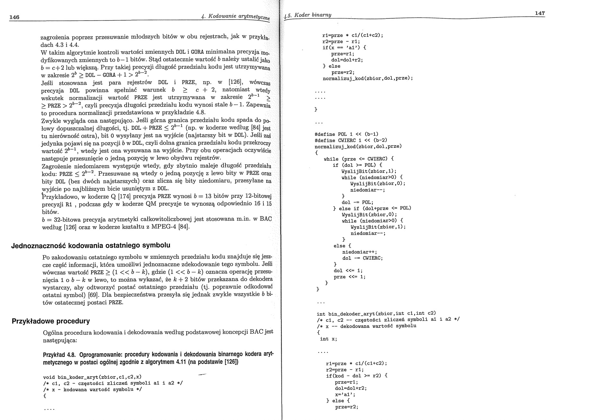
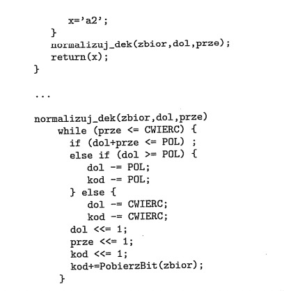

Implementacja w pliku `main.py` bazująca na pseudokodzie z ksiąki Artura Przelaskowskiego "Kompresja Danych - podstawy, metody bezstratne, kodery obrazów" (fragmenty dostępne na zdjęciach w `images/pseudokod.jpg`)

